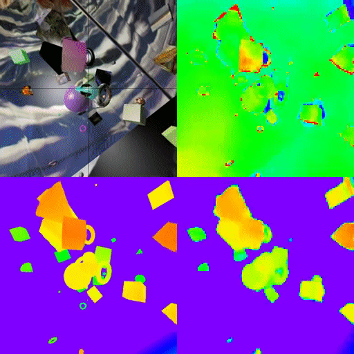
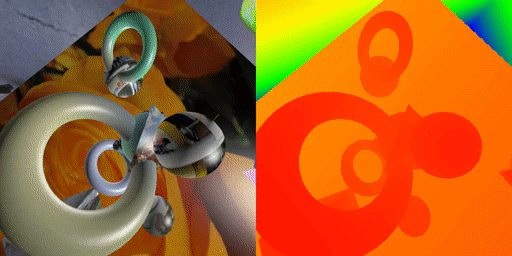

# DepthNet training on Still Box

### [Project page](http://perso.ensta-paristech.fr/~pinard/depthnet/)

This code can replicate the results of our paper that was published in UAVg-17.



**[End-to-end depth from motion with stabilized monocular videos](https://hal.archives-ouvertes.fr/hal-01587652v1)**

* This code shows how the only translational movement of the camera can be leveraged to compute a very precise depth map, even at more than 300 times the displacement.
* Thus, for a camera movement of 30cm (nominal displacement used here), you can see as far as 100m.

See our second paper for information about using this code on real videos with speed estimation

**[Multi range Real-time depth inference from a monocular stabilized footage using a Fully Convolutional Neural Network](https://hal.archives-ouvertes.fr/hal-01587658v1)**

*Click Below for video*

[](http://www.youtube.com/watch?v=nU-Gv_I7zhg)

## DepthNet

DepthNet is a network designed to infer Depth Map directly from a pair of stabilized image.

* No information is given about movement direction
* DepthNet is Fully Convolutional, which means it is completely robust to optical center fault
* This network only works for pinhole-like pictures

## Still Box



Still box is a dataset created specifically for supervised training of depth map inference for stabilized aerial footage. It tries to mimic typical drone footages in static scenes, and depth is **impossible** to infer from a single image, as shapes get all kinds of sizes and positions.

* You can download it [here]() (50GB torrent only for the moment, if you have a solution to host it, feel free to contact me !)
* Still box `README.md` can be consulted [here](https://gist.github.com/ClementPinard/cae0ae658e516131135158d4fb9d2a1e)

## Training

### Requirements

```
[sudo] pip3 install -r requirements.txt
```

If you want to log some outputs from the validation set with the `--log-output` option, you need openCV3 to convert depth to RGB with a rainbow colormap. 
> *TODO: we should still log output as a greyscale if cv import fails*

### Usage

Best results can be obtained by training on *still box 64* and then finetuned successively up to the resolution you target. Here are the parameters used for the paper *(please note how learning rate and batch size are changed, training was done a single GTX 980Ti)*.

```
python3 train.py -j8 --lr 0.01 /path/to/still_box/64/ --log-output --activation-function elu --bn
```

```
python3 train.py -j8 --lr 0.01 /path/to/still_box/128/ --log-output --activation-function elu --bn --pretrained /path/to/DepthNet64
```

```
python3 train.py -j8 --lr 0.001 /path/to/still_box/256/ --log-output --activation-function elu --bn -b64 --pretrained /path/to/DepthNet128
```

```
python3 train.py -j8 --lr 0.001 /path/to/still_box/512/ --log-output --activation-function elu --bn -b16 --pretrained /path/to/DepthNet256
```

> **Note**: You can skip 128 and 256 training if you don't have time, results will be only slightly worse. However, you need to do 64 training first as stated by our first paper. This might has something to do with either the size of 64 dataset (in terms of scene numbers) or the fact that feature maps are reduced down to 1x1 making last convolution a FC equivalent operation

### Custom FOV and focal length

Every image in still box is 90° of FOV (field of view), focal length (in pixels) is then respectively

* 32px for 64x64 images
* 64px for 128x128 images
* 128px for 128x128 images
* 256px for 512x512 images

Training is not flexible to focal length, and for a custom focal length you will have to run a dedicated training.

If you need to use a custom focal length and FOV you can simply resize the pictures and crop them.

Say you have a picture of width `w` with an associated FOV `fov`. To get equivalent from one of the datasets you can first crop the still box pictures so that FOV will match `fov` (cropping doesn't affect focal length in pixels), and then resize it to `w`. Note that DepthNet can take rectangular pictures as input.

`cropped_w = w/tan(pi*fov/360)`

we naturally recommend to do this operation offline, metadata from `metadata.json` won't need to be altered.

#### with pretrained DepthNet

If you can resize your test pictures, thanks to its fully convolutional architecture, DepthNet is flexible to fov, as long as it stays below 90° (or max FOV encountered during training). Referring back to our witdh `w` and FOV `fov` we get with a network trained with a particular focal length `f` the following width to resize to:

`resized_w = f/2*tan(pi*fov/360)`

----
> **/!\ These equations are only valid with pinhole equivalent cameras. Be sure to correct distortion before using DepthNet**


## Visualise training

Training can be visualized via tensorboard by launching this command in another terminal
```
tensorboard --logdir=/path/to/DepthNet/Results
```

You can then access the board from any computer in the local network by accessing `machine_ip:6006` from a web browser, just as a regular tensorboard server. More info [here](https://www.tensorflow.org/get_started/summaries_and_tensorboard)
